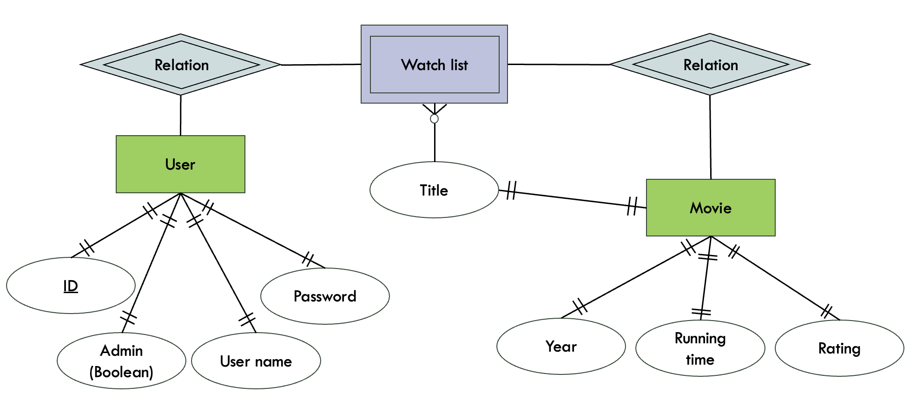
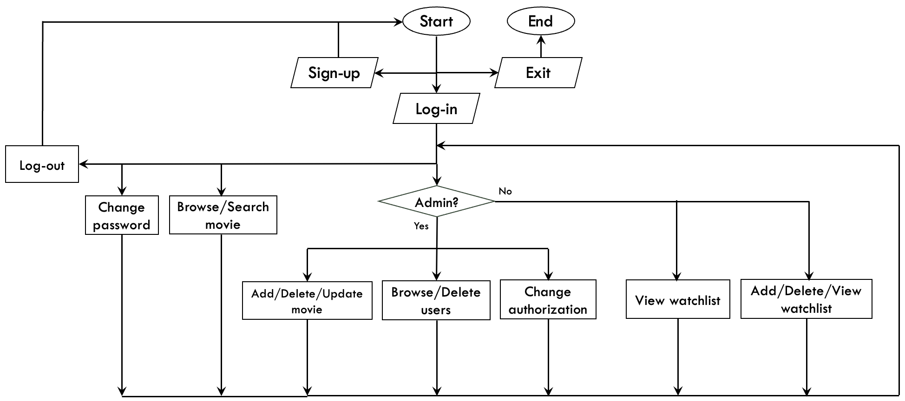

# Online Movie Store

Online Movie Store application using TypeScript, npm, Azure SQL (MSSQL), and React. This is a project assignment for the course of **Software Programming Foundation and Data Modelling** offered by **Institute of Applied Technology** in collaboration with **TAFE NSW**, Australia.

## Features

- Easy-to-use Command Line Interface (CLI)
- CRUD Functionality
  - User authentication & authorization
    - User registration, login, and logout functionality
  - Data Manipulation and Storage
    - Add, update, delete, and view movie data.
    - Manage a watchlist for every user

## Tech stack

- Programming language
  - Typescript
- Frontend frameworks
  - React.js
- Web application framework
  - Express.js
- Server-side tool
  - Node.js
- Package management
  - npm
- Database management
  - Azure SQL
- Containerization
  - Docker

## ERD



## Pseudocode Flowchart



## Instruction

### 1. Backend

Locate the Backend directory

- Install package
  - In terminal, type `npm i`
  - In terminal, type `npm i msnodesqlv8`
- Run the backend server
  - In terminal, type `node index`

### 2. Containerization & Azure SQL

\*Disclaimer: In this project, SQL Server 2022 (16.x) Linux container image was tested on MacOS and may not work on other operating systems.

- Pull the SQL Server 2022 (16.x) Linux container image from the Microsoft Container Registry.

  ```
  sudo docker pull mcr.microsoft.com/mssql/server:2022-latest
  ```

- Run the Linux container image with Docker

  ```
  sudo docker run -e "ACCEPT_EULA=Y" -e MSSQL_SA_PASSWORD=ABCdefgh@ -p 1433:1433 \
  --name sql1 --hostname sql1 -d \
  mcr.microsoft.com/mssql/server:2022-latest
  ```

- Check if Docker container works

  ```
  sudo docker ps -a
  ```

  Output should be similar to

  ```
  CONTAINER ID   IMAGE                                        COMMAND                     CREATED        STATUS          PORTS               NAMES
  d4a1999ef83e   mcr.microsoft.com/mssql/server:2022-latest   "/opt/mssql/bin/perm..."   2 minutes ago   Up 2 minutes   0.0.0.0:1433->1433/tcp, :::1433->1433/tcp   sql1
  ```

- Start an interactive bash shell inside the running container
  ```
  sudo docker exec -it sql1 "bash"
  ```
- Inside the container, connect locally with **sqlcmd**
  ```
  /opt/mssql-tools/bin/sqlcmd -S localhost -U SA -P ABCdefgh@
  ```

### 3. Set up basic database

- Create a database called "TAFEDB"

  ```
  CREATE DATABASE TAFEDB;
  ```

  ```
  GO
  ```

- Locate the TAFEDB database

  ```
  USE TAFEDB;
  ```

  ```
  GO
  ```

- Create a table 'MovieInfo' to store movie information

  ```
  CREATE TABLE MovieInfo (id INT NOT NULL IDENTITY(1,1) PRIMARY KEY, title varchar(255) NOT NULL, year INT, runtime FLOAT, rating FLOAT)
  ```

  ```
  GO
  ```

- Create a table 'UserInfo' to store user information

  ```
  CREATE TABLE UserInfo (id INT NOT NULL IDENTITY(1,1) PRIMARY KEY, username varchar(255) NOT NULL, password varchar(255) NOT NULL, admin varchar(10) NOT NULL DEFAULT 'NO')
  ```

  ```
  GO
  ```

- Insert one admin account to 'UserInfo' as an initial log-in account

  ```
  INSERT INTO UserInfo (username, password, admin) VALUES ('admin1', 'admin1', 'YES');
  ```

  ```
  GO
  ```

### 4. Frontend

Locate the Frontend directory

- Install package

  - In terminal, type `npm i`

- Run the backend server
  - In terminal, type `node index`
